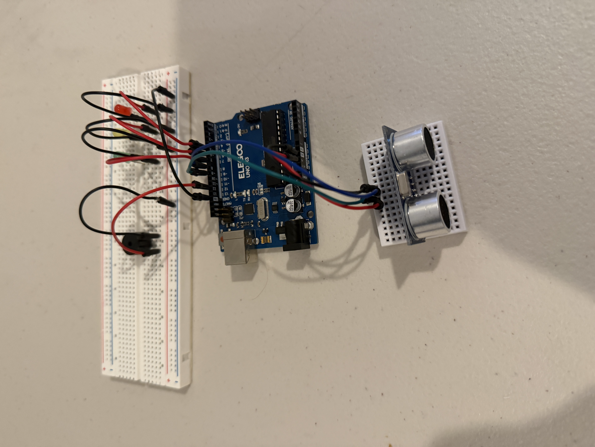
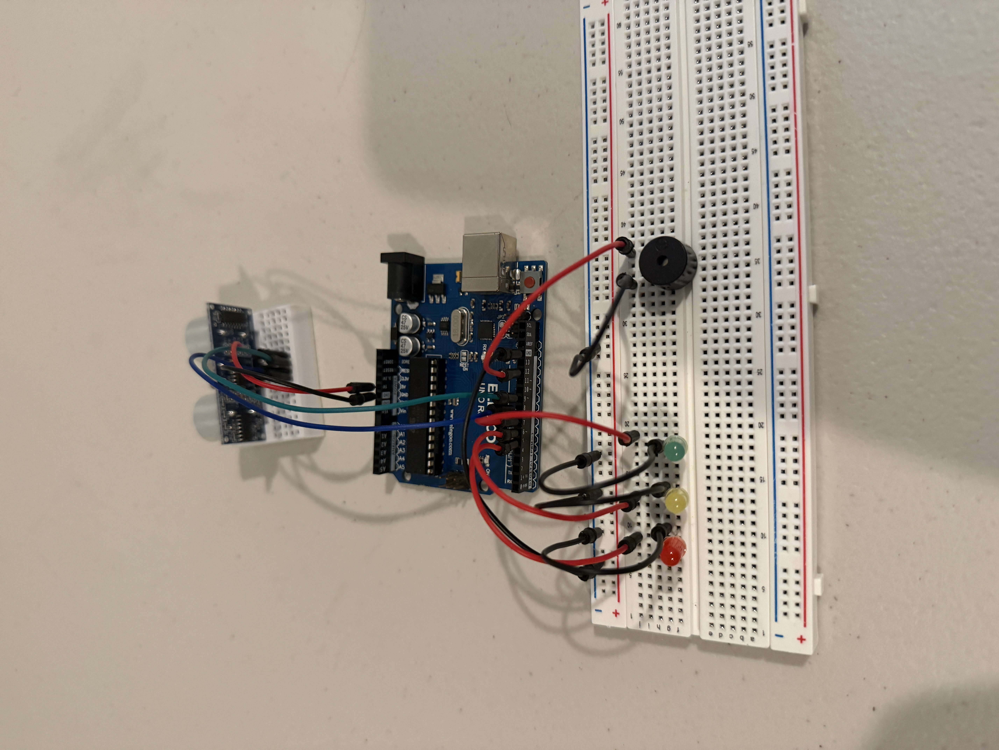

# Arduino Intelligent Ultrasonic Proximity Alert System

A smart distance warning system built with Arduino using an ultrasonic sensor, LEDs, and a buzzer. The system measures nearby object distance in real time and responds with escalating visual and audio alerts based on proximity.

## Features

- Real-time distance measurement in centimeters
- Multi-zone warning system
- Green LED for safe range
- Yellow LED for caution range
- Red LED for danger and critical range
- Adaptive buzzer alerts based on object distance
- Non-blocking timing using `millis()`
- Live distance data through Serial Monitor
- Modular Arduino code using reusable functions

## Distance Zones

### Safe Zone
- Greater than 30 cm
- Green LED ON
- No sound

### Caution Zone
- Between 15 cm and 30 cm
- Yellow LED ON
- Slow warning beeps

### Danger Zone
- Between 5 cm and 15 cm
- Red LED ON
- Faster warning beeps

### Critical Zone
- Less than 5 cm
- Red LED ON
- Continuous alarm tone

## Components Used

- Arduino Uno
- Ultrasonic Sensor (HC-SR04 / PING)))
- Red LED
- Yellow LED
- Green LED
- Passive or Active Buzzer
- Breadboard
- Jumper Wires
- Resistors

## Project Images

### Front View

### Back View

## Files Included

- `main.ino` → Arduino source code
- `README.md` → Project documentation
- `frontCircuit.jpg` → Front circuit photo
- `backCircuit.jpg` → Back circuit photo

## Skills Demonstrated

- Sensor integration
- Embedded systems programming
- Distance measurement using sound waves
- Real-time control systems
- Non-blocking timers with `millis()`
- Functional code design
- Hardware debugging
- Breadboard circuit assembly

## Future Improvements

- LCD live distance display
- Adjustable thresholds with potentiometer
- Servo-controlled barrier gate
- Parking assist mode
- Data logging to SD card
- OLED graphical display

## Author

Ziyan Ali  
Aspiring Electrical Engineering and Computer Engineering Student
